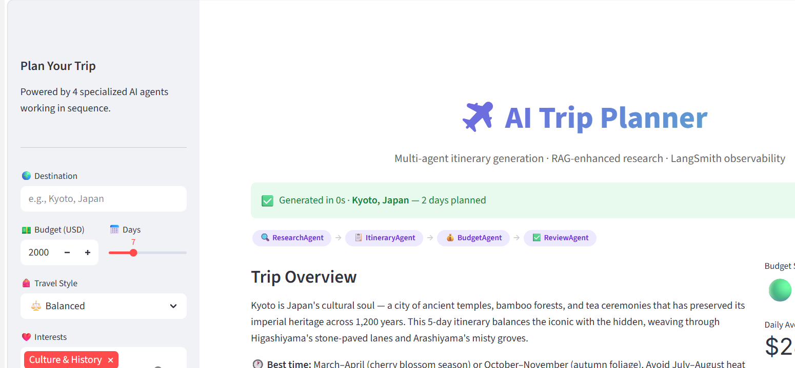

# AI Trip Planner

> Personalized day-by-day travel itineraries generated by a **LangGraph multi-agent pipeline** with **RAG-enhanced research** and end-to-end **LangSmith observability**.


## Architecture

```
User Input
    │
    ▼
FastAPI Backend
    │
    ▼
┌─────────────────────────────────────────────────┐
│            LangGraph Agent Pipeline              │
│                                                  │
│  ┌──────────────┐    ┌──────────────────────┐   │
│  │ ResearchAgent│───▶│   ItineraryAgent     │   │
│  │              │    │                      │   │
│  │ ChromaDB RAG │    │ Groq LLaMA 3.1 + RAG │   │
│  └──────────────┘    └──────────┬───────────┘   │
│                                 │                │
│  ┌──────────────┐    ┌──────────▼───────────┐   │
│  │ ReviewAgent  │◀───│    BudgetAgent       │   │
│  │              │    │                      │   │
│  │ Final QA     │    │ Cost validation + KPI│   │
│  └──────────────┘    └──────────────────────┘   │
│                                                  │
│  All agents traced end-to-end with LangSmith     │
└─────────────────────────────────────────────────┘
    │
    ▼
Streamlit Frontend
(Plotly charts · Budget analytics · Day-by-day view)
```

## Screenshots

### Generated Itinerary


### Budget Analytics Dashboard


## Tech Stack

| Layer | Technology | Purpose |
|-------|-----------|---------|
| Agents | **LangGraph** | Multi-agent orchestration with typed state |
| LLM | **Groq LLaMA 3.1 70B** | Reasoning across all 4 agents — free tier |
| Embeddings | **sentence-transformers all-MiniLM-L6-v2** | Free local embeddings, no API cost |
| RAG | **ChromaDB + LangChain** | Travel knowledge retrieval (14 documents) |
| Observability | **LangSmith** | Agent tracing, latency, token usage |
| Backend | **FastAPI** | Async REST API with in-memory caching |
| Frontend | **Streamlit + Plotly** | Interactive UI with budget analytics |
| Cache | **Redis** | Response caching by destination hash |
| Infrastructure | **Docker + Compose** | Containerized multi-service deployment |

## Features

- **4-Agent Pipeline** — ResearchAgent → ItineraryAgent → BudgetAgent → ReviewAgent, each traced in LangSmith
- **RAG-enhanced research** — ChromaDB retrieves relevant travel knowledge (14 docs across 6 regions) before generation
- **LangSmith tracing** — Every agent call observable with latency, token count, and chain visualization
- **Budget analytics** — Donut chart breakdown, daily cost bar chart, budget gauge with variance
- **Prompt-level caching** — Same destination/params served from cache in milliseconds (SHA-256 key)
- **Structured output** — Pydantic-validated schemas with `travel_style` allowlist validation at every pipeline stage
- **Resilient agents** — Exponential backoff retry (3 attempts) on transient Groq API errors
- **Popular destinations** — `/destinations/popular` endpoint with curated list filterable by region/budget
- **Travel style options** — `budget` / `balanced` / `comfort` / `luxury` / `eco` (triggers sustainability RAG context)

## Quick Start

```bash
git clone https://github.com/DharshanaReddy/ai-trip-planner
cd ai-trip-planner
cp .env.example .env  # add your API keys
```

**Option A — Docker (recommended):**
```bash
docker-compose up --build
# Frontend: http://localhost:8501
# Backend:  http://localhost:8000/docs
```

**Option B — Local:**
```bash
pip install -r requirements.txt

# Terminal 1 — Backend
uvicorn backend.main:app --port 8000 --reload

# Terminal 2 — Frontend
cd frontend && streamlit run app.py
```

## Environment Variables

See [`.env.example`](.env.example) for the full list with comments. Minimum required:

| Variable | Required | Description |
|----------|----------|-------------|
| `GROQ_API_KEY` | Yes | Free at [console.groq.com](https://console.groq.com) |
| `LANGCHAIN_API_KEY` | Recommended | LangSmith tracing — free at [smith.langchain.com](https://smith.langchain.com) |
| `LANGCHAIN_TRACING_V2` | No | Set `true` to enable LangSmith traces |
| `REDIS_URL` | No | Redis for persistent caching (in-memory used if unset) |
| `BACKEND_URL` | No | Frontend → Backend URL (default: `http://localhost:8000`) |

## API Reference

**Generate itinerary:**
```bash
POST /generate-itinerary
{
  "destination": "Kyoto, Japan",
  "budget": 2000,
  "duration": 7,
  "interests": ["Culture & History", "Food & Cuisine"],
  "travel_style": "balanced"
}
```

**Popular destinations:**
```bash
GET /destinations/popular?region=Asia&max_budget=1500
```

**Health check:**
```bash
GET /health
# {"status": "healthy", "version": "2.1.0", "environment": "development"}
```

Full interactive docs at `/docs` (Swagger UI) and `/redoc`.

## LangSmith Observability

Each trip generation creates a traced run in LangSmith showing:
- Per-agent latency breakdown (ResearchAgent is typically the slowest due to RAG retrieval)
- Token consumption at each node
- Full input/output for every agent for debugging
- Chain visualization of the 4-node LangGraph

Get a free LangSmith key at [smith.langchain.com](https://smith.langchain.com)

## Project Structure

```
ai-trip-planner/
├── backend/
│   ├── agents/
│   │   ├── graph.py          # LangGraph pipeline definition
│   │   ├── nodes.py          # 4 agent nodes with retry logic
│   │   └── state.py          # TripState TypedDict
│   ├── rag/
│   │   ├── knowledge_base.py # 14 travel documents across 6 regions
│   │   └── vectorstore.py    # ChromaDB + sentence-transformers
│   ├── config.py             # Pydantic settings
│   ├── main.py               # FastAPI app
│   └── schemas.py            # Pydantic request/response models
├── frontend/
│   └── app.py                # Streamlit multi-page app
├── docs/screenshots/         # App screenshots
├── .env.example
├── docker-compose.yml
└── requirements.txt
```
